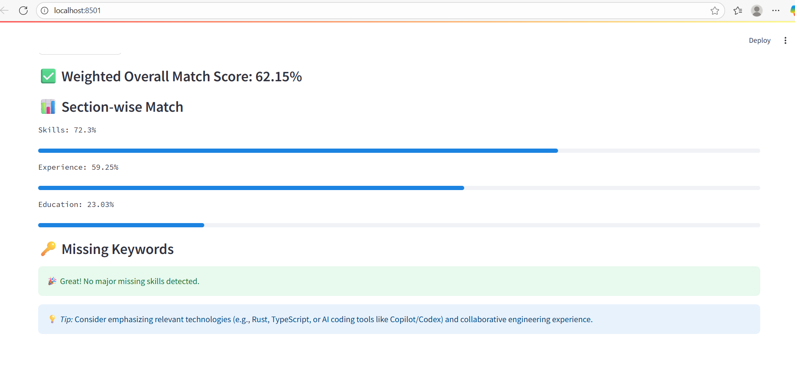

# 📄 AI-Powered Resume Analyzer (NLP + Transformers)

An AI-powered resume intelligence system that analyzes resumes against job descriptions using transformer-based semantic embeddings.

Instead of relying only on keyword matching, this application uses Sentence Transformers to understand contextual meaning, calculate similarity scores, identify skill gaps, and provide section-level insights.

---

## 🌟 Demo

🎥 Demo video: Coming soon

🚀 Live deployment: Coming soon on Streamlit Cloud

---
## 🏗️ Architecture
            
                         Resume PDF
                             |
                             v
                    Document Parser
                     (pdfplumber)
                             |
                             v
                  Text Preprocessing
              (cleaning, normalization)
                             |
                             v
              Sentence Transformer Model
                 (all-MiniLM-L6-v2)
                             |
              -----------------------------
              |                           |
              v                           v
     Resume Embeddings          Job Description
                                      Embeddings
              |                           |
              -------------+-------------
                           |
                           v
              Cosine Similarity Calculation
                           |
              -----------------------------
              |                           |
              v                           v
        Match Score              Skill Gap Analysis
              |
              v
          Streamlit Dashboard

---

## 🚀 Features
- 🧠 **AI-Powered Semantic Analysis** — Uses pretrained Transformer model `all-MiniLM-L6-v2` to understand text meaning, not just keywords.
- 📑 **PDF Resume Parsing** — Extracts and processes text from uploaded resume PDFs.
- 🔍 **Smart Resume–Job Comparison** — Computes cosine similarity between embeddings for accurate match scoring.
- 📊 **Section-wise Insights** — Analyzes *Skills*, *Experience*, and *Education* separately.
- 💡 **Keyword Gap Detection** — Suggests missing technical skills and action verbs.
- 🌐 **Interactive UI** — Built with **Streamlit** for simple, beautiful web deployment.

---

## 🧰 Tech Stack
| Category | Tools / Libraries |
|-----------|-------------------|
| Language | Python 3.9+ |
| NLP Model | SentenceTransformers (`all-MiniLM-L6-v2`) |
| ML Tools | scikit-learn, numpy |
| Text Extraction | pdfplumber |
| Web App | Streamlit |
| Others | re, cosine similarity, data preprocessing |

---

## ⚙️ Installation & Usage

### 1️⃣ Clone the Repository
git clone https://github.com/lina2016/resume-analyzer.git
cd resume-analyzer

### 2️⃣ Install Dependencies
pip install -r requirements.txt

### 3️⃣ Run the Application
streamlit run src/app.py

### 4️⃣ Access the App

Visit 👉 http://localhost:8501 in your browser.

🧾 Example Output

✅ Overall Match Score: 72.4%

📊 Section-wise Match:
Skills: 80.1%
Experience: 68.3%
Education: 59.2%

🔑 Missing Keywords:
Python
AWS
Docker
Kubernetes
TypeScript
React

📂 Project Structure
```
resume-analyzer/
│── src/
│   ├── parser.py          # Extracts text from resume PDFs
│   ├── analyzer.py        # Core NLP, embeddings, and scoring logic
│   └── app.py             # Streamlit UI
│── data/
│   ├── sample_resume.pdf
│   └── sample_job_description.txt
│── requirements.txt
│── README.md
│── .gitignore
│── LICENSE
```

## 🧠 AI Methodology
The system converts resume and job description text into numerical vector representations using Sentence Transformer embeddings.

The similarity between documents is calculated using cosine similarity:

- Higher similarity score → stronger resume alignment
- Lower similarity score → potential skill gaps

This approach captures semantic relationships beyond exact keyword matching.


✅ It’s an Applied AI project showcasing both machine learning understanding and software engineering capability.


## 🧩 Future Enhancements

- 🤖 Add LLM-powered resume improvement recommendations
- 🔍 Implement RAG-based career guidance using resume context
- 🧠 Add NER-based skill extraction using spaCy
- 📊 Add ATS compatibility scoring
- 🔗 Integrate job search APIs for personalized matching
- ☁️ Deploy production version using FastAPI + cloud infrastructure


🧾 License

This project is licensed under the MIT License.
Feel free to use, modify, and share it — just credit the author.

💬 Contact

If you found this project helpful or want to collaborate:

📧 linajamadar@gmail.com

🔗 LinkedIn : https://www.linkedin.com/in/lina-jamadar/
 | GitHub : https://github.com/lina2016

⭐ If you like this project, please consider giving it a star on GitHub!
It helps others discover this work and supports open-source learning.

## Screenshots


## 👩‍💻 Author
**Lina Jamadar**
AI Engineer | Python Developer | Full-Stack Web Developer
📍 Surat, Gujarat, India
🔗 [LinkedIn](https://www.linkedin.com/in/lina-jamadar) | [GitHub](https://github.com/lina2016)
